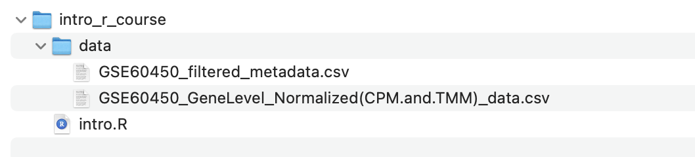

:::::::::::::::::::::::::::::::::::::: questions 

- How can I load data from CSV or TSV files into R?
- What are some functions in R that can be used to examine the data?

::::::::::::::::::::::::::::::::::::::::::::::::

::::::::::::::::::::::::::::::::::::: objectives

- Load in our RNA-seq data files into R
- Try using some functions to explore data frames (tables) in R
- Learn how to subset parts of a data frame

::::::::::::::::::::::::::::::::::::::::::::::::


## Getting started with the data

In this tutorial, we will learn some R through creating plots to
visualise data from an RNA-seq experiment.

The [GREIN platform](https://www.nature.com/articles/s41598-019-43935-8)
(GEO RNA-seq Experiments Interactive Navigator) provides \>6,500
published datasets from GEO that have been uniformly processed. It is
available at <http://www.ilincs.org/apps/grein/>. You can search for a
dataset of interest using the GEO code. GREIN provide QC metrics for the
RNA-seq datasets and both raw and normalized counts. We will use the
normalized counts here. These are the counts of reads for each gene for
each sample normalized for differences in sequencing depth and
composition bias. Generally, the higher the number of counts the more
the gene is expressed.


## RNA-seq dataset from Fu et al.

Here we will create some plots using RNA-seq data from the paper by [Fu et al. 2015](https://www.ncbi.nlm.nih.gov/pubmed/25730472) (GEO accession number GSE60450). Mice, like all mammals, have mammary glands which produce milk to nourish their young. The authors of this study were interested in examining how the mammary epithelium (which line the mammary glands) expands and develops during pregnancy and lactation. 

This study examined expression in basal and luminal cells from mice at different stages (virgin, pregnant and lactating). Basal cells are mammary stem cells and luminal cells secrete milk. There are 2 samples per group and 6 groups, so 12 samples in total.


-----

## Tidyverse

{width=100%}

The `tidyverse` package that we installed previously is a collection of R packages 
that includes the extremely widely used **`ggplot2`** package.

The [tidyverse](https://www.tidyverse.org/) makes data science faster,
easier and more fun.

{width=100%}

Tidyverse is built on the principle of organizing data in a [tidy format](https://www.openscapes.org/blog/2020/10/12/tidy-data/).

-----

## Data files

::::::::::::::::::::::::::::::::::::: challenge

#### Your turn 2.1

If you haven't already downloaded the data.zip file for this workshop, you can click [here](../learners/data/data.zip) to download it now.

Unzip the file and store the extracted `data` folder in your working directory.

:::::::::::::::::::::::::::::::::::::::::::::::::

::::::::::::::::::::::::: callout

#### Make sure the data is in the correct directory

Inside your current working directory directory (e.g. `intro_r_course`), there should be a directory called `data` and inside that directory should be two CSV files.

{width=80%}

In the next section, you will load these files into R using the file path (i.e. where they are located in the filesystem), so the code in this tutorial expects the files to be in the above location. If you have the files in a different location, you also have the option of changing the commands in the following sections to match where the files are located on your computer.

::::::::::::::::::::::::::::::::::

## Loading the data

We use `library()` to load in the packages that we need. As described in the cooking analogy in the first screenshot, `install.packages()` is like buying a saucepan, `library()` is taking it out of the cupboard to use it.

::::::::::::::::::::::::::::::::::::: challenge

#### Your turn 2.2

Load in the tidyverse package using the `library()` function:

```{r, message=FALSE, warning=FALSE}
library(tidyverse)
```

:::::::::::::::::::::::::::::::::::::::::::::::::

The files we will use are CSV comma-separated, so we will use the `read_csv()` function from the tidyverse. There is also a `read_tsv()` function for tab-separated values.

We will use the counts file called `GSE60450_GeneLevel_Normalized(CPM.and.TMM)_data.csv` that's in a folder called `data` i.e. the path to the file should be `data/GSE60450_GeneLevel_Normalized(CPM.and.TMM)_data.csv`.

We can read the counts file into R with the command below. We'll store the contents of the counts file in an **object** called `counts`. This stores the file contents in R's memory making it easier to use.


::::::::::::::::::::::::::::::::::::: challenge

#### Your turn 2.3

Load the count data into R. We will store the contents of the counts file in an **object** called `counts`. Note that we need to put quotes ("") around file paths.

```{r}
# Read in counts file
counts <- read_csv("data/GSE60450_GeneLevel_Normalized(CPM.and.TMM)_data.csv")
```

Note: In R, structured tables like these are called **data frames**.

:::::::::::::::::::::::::::::::::::::::::::::::::


:::::::::::::::::::: callout

#### Tab completion for file paths

We mentioned tab completion in the previous section, but tab completion can also complete file paths. This means you don't have to type out the long filenames in the codeblock above, but instead, begin to type out a few characters, then press <kbd>tab</kbd> and see the autocompletion options.


::::::::::::::::::::::::::::


No need to be overwhelmed by the outputs! It contains information
regarding "column specification" (telling us that there is a missing
column name in the header and it has been filled with the name "...1",
which is how read_csv handles missing column names by default). We will
fix this later. It also tells us what data types `read_csv` is detecting
in each column. Columns with text characters have been detected
(`col_character`) and also columns with numbers (`col_double`). We won't
get into the details of R data types in this tutorial but they are
important to know when you get more proficient in R. You can read more
about them in the [R for Data Science
book](https://r4ds.had.co.nz/vectors.html#important-types-of-atomic-vector).


::::::::::::::::::::::::::::::::::::: challenge

#### Your turn 2.4

Load the sample information data into R. We will store the contents of this file in an object called 
`sampleinfo`. 

```{r}
# Read in metadata
sampleinfo <- read_csv("data/GSE60450_filtered_metadata.csv")
```

:::::::::::::::::::::::::::::::::::::::::::::::::


It is very common when looking at biological data that you have two types of data. One is the actual data (in this case, our `counts` object, which has the
expression values of different genes in each sample). The other is **metadata**
i.e. information about our samples (in this case, our `sampleinfo` object includes information about whether samples are from basal or luminal cells and
whether the cells were from mice which are virgin/pregnant/lactating, etc.)


**What data have we imported into R?**  
To summarise, we have imported two data frames (i.e. tables) into R:

-   `counts` object is our gene expression data
-   `sampleinfo` object is our sample metadata


::::::::::::::::::::::::::::::::::::: challenge


#### Your turn 2.5

Let's get used to making some mistakes in R, so we know what errors look like and how to handle them.

1. Test what happens if you type 
`Library(tidyverse)`  
What is wrong and how would you fix it?

2. Test what happens if you type
`library(tidyverse`  
What is wrong and how would you fix it?

3. Test what happens if you type  
`read_tsv("data/GSE60450_filtered_metadata.csv")`  
What is wrong and how would you fix it?  
 
4. Test what happens if you type  
`read_csv("data/GSE60450_filtered_metadata.csv)`  
What is wrong and how would you fix it?  
 
5. Test what happens if you type  
`read_csv("GSE60450_filtered_metadata.csv")`  
What is wrong and how would you fix it?  


Don't forget you can press <kbd>ESC</kbd> to escape the current command and start a new prompt.

:::::::::::::::::::::::::::::::::::::::::::::

-----

## Getting to know the data

When assigning a value to an object, R does not print the value. We do
not see what is in `counts` or `sampleinfo`. But there are ways we can
look at the data.


::::::::::::::::::::::::::::::::::::: challenge

#### Your turn 2.6


Click on the `sampleinfo` object in your global environment panel on the 
right-hand-side of RStudio. This will open a new tab.

This is the equivalent of using the `View()` function. e.g.

```{r eval=FALSE}
View(sampleinfo)
```


:::::::::::::::::::::::::::::::::::::::::::::::::


::::::::::::::::::::::::::::::::::::: challenge

#### Your turn 2.7

Type the name of the object and this will print the first few lines and 
some information, such as number of rows.
Note that this is similar to how we looked at the value of objects we 
assigned in the previous section.

```{r}
sampleinfo
```

:::::::::::::::::::::::::::::::::::::::::::::::::

We can also take a look the first few lines with `head()`. This shows us
the first 6 lines.

::::::::::::::::::::::::::::::::::::: challenge

#### Your turn 2.8

Use `head()` to look at the first few lines of `counts`. 

```{r}
head(counts)
```

:::::::::::::::::::::::::::::::::::::::::::::::::

We can also look at the last few lines with `tail()`. This shows us the last
6 lines. This can be useful to check the bottom of the file, that it
looks ok.

::::::::::::::::::::::::::::::::::::: challenge

#### Your turn 2.6

Use `tail()` to look at the last few lines of `counts`. 

```{r}
tail(counts)
```

:::::::::::::::::::::::::::::::::::::::::::::::::


::::::::::::::::::::::::::::::::::::: challenge

#### Your turn 2.7

What are the cell types of the first 6 samples in the metadata for the Fu et al. 2015 experiment?

:::::::::::::::: solution

```{r}
head(sampleinfo)
```

The first 6 samples are luminal cells. 

::::::::::::::::::::::::::

:::::::::::::::::::::::::::::::::::::::::::::::::

-----

## Dimensions of the data

You can print the number of rows and columns using the function `dim()`. 

For example:

```{r}
dim(sampleinfo)
```

`sampleinfo` has 12 rows, corresponding to our 12 samples, and 4 columns, corresponding to different features about the samples. 

:::::::::::::::::: callout

#### Tip: Always Verify Your Data Size

Double-check that your data has the expected number of rows and columns. It's easy to read the wrong file or encounter corrupted downloads. Catching these issues early will save you a lot of trouble later!

:::::::::::::::::::::::::::


::::::::::::::::::::::::::::::::::::: challenge

#### Your turn 2.8

Check how many rows and columns are in `counts`. Do these numbers match what we expected?

:::::::::::::::: solution

```{r}
dim(counts)
```

We know that there are 12 samples in our data (see the diagram above), and we don't know how many genes were measured. 

**Rows:** 23735. This means there are 23735 genes, which could be correct (we didn't know how many genes were measured). 

**Columns:** 14. We would expect to have 12 columns corresponding to our 12 samples, but instead we have 14. Why is this? Have a look back at when we visualised the `counts` data, there are two extra columns in the data corresponding to gene IDs and gene names.

::::::::::::::::::::::::::

:::::::::::::::::::::::::::::::::::::::::::::::::


In the Environment Tab in the top right panel in RStudio we can also see the number of rows and columns in the objects we have in our session.

-----


## Column and row names of the data


::::::::::::::::::::::::::::::::::::: challenge

#### Your turn 2.9

Check the column and row names used in in `sampleinfo`

```{r, eval = FALSE}
colnames(sampleinfo)
rownames(sampleinfo)
```


:::::::::::::::::::::::::::::::::::::::::::::::::

-----

## Subsetting


Subsetting is very useful tool in R which allows you to extract parts of the data you want
to analyse. There are multiple ways to subset data and here we'll only cover a few.

We can use the `$` operator to access individual columns by name.

::::::::::::::::::::::::::::::::::::: challenge

#### Your turn 2.10

Extract the 'immunophenotype' column of the metadata. 

```{r, eval = FALSE}
sampleinfo$immunophenotype
```

:::::::::::::::::::::::::::::::::::::::::::::::::


We can also use square brackets `[ ]` to access the rows and columns of a matrix or a table.

For example, we can extract the first row '1' of the data, using the number
on the *left-hand-side* of the comma.

::::::::::::::::::::::::::::::::::::: challenge

#### Your turn 2.11

Extract the first row using square brackets. 

```{r, eval = FALSE}
sampleinfo[1,]
```

:::::::::::::::::::::::::::::::::::::::::::::::::

Here we extract the second column '2' of the data, as indicated on
the *right-hand-side* of the comma.

::::::::::::::::::::::::::::::::::::: challenge

#### Your turn 2.12

Extract the second column using square brackets. 

```{r, eval = FALSE}
sampleinfo[,2]
```

:::::::::::::::::::::::::::::::::::::::::::::::::


::: callout

####  Common R Error: Missing Comma in Subsetting

When subsetting data frames or matrices (which have *two* dimensions, i.e. rows and columns), always use a comma to separate rows and columns, like `sampleinfo[1, ]`. Forgetting the comma, as in `sampleinfo[1]`, will cause an error. Try it yourself and see what happens!

:::


You can use a combination of number of row and column to extract one
element in the matrix. 


::::::::::::::::::::::::::::::::::::: challenge

#### Your turn 2.13

Extract the element in the first row and second column. 

```{r, eval = FALSE}
sampleinfo[1,2]
```

:::::::::::::::::::::::::::::::::::::::::::::::::


::::::::::::::::::::::::::::::::::::: challenge

#### Your turn 2.14

We can also subset using a range of numbers. For example, if we wanted the first
three rows of `sampleinfo`

```{r, eval = FALSE}
sampleinfo[1:3,]
```

Or if we wanted the 2nd, 4th, and 5th row:

```{r, eval = FALSE}
sampleinfo[c(2,4,5),]
```

:::::::::::::::::::::::::::::::::::::::::::::::::


::: callout
#### The c() function

We use the `c()` function extremely often in R when we have multiple items
that we are *combining* ('c' stands for concatenating). We will see it
again in this tutorial.
:::

-----

## Renaming column names

In the previous section, when we loaded in the data from the csv file, we noticed that the first column had a missing column name and by default, read_csv function assigned a name of "\...1" to it. Let's change this column to something more descriptive now. We can do this by combining a few things we've just learnt.

::::::::::::::::::::::::::::::::::::: challenge

#### Your turn 2.15

First, we use the `colnames()` function to obtain the column names of sampleinfo. Then we use square brackets to subset the first value of the column names (`[1]`). Last, we use the assignment operator (`<-`) to set the new value of the first column name to "sample_id".

```{r}
colnames(sampleinfo)[1] <- "sample_id"
```

:::::::::::::::::::::::::::::::::::::::::::::::::

Let's check if this has been changed correctly.

```{r}
sampleinfo
```

The first column is now named "sample_id". 

We can also do the same to the counts data. This time, we rename the first column name from "\...1" to "gene_id".

::::::::::::::::::::::::::::::::::::: challenge

#### Your turn 2.16

```{r}
colnames(counts)[1] <- "gene_id"
```

:::::::::::::::::::::::::::::::::::::::::::::::::

Note: there are multiple ways to rename columns. We've covered one way here, but another way is using the `rename()` function. When programming, you'll often find many ways to do the same thing. Often there is one obvious method depending on the context you're in. 

-----

## Structure and Summary

Other useful commands for checking data are `str()` and `summary()`.

`str()` shows us the structure of our data. It shows us what columns there are, the first few entries, and what data type they are e.g. character or numbers (double or integer).

```{r}
str(sampleinfo)
```

`summary()` generates summary statistics of our data. For numeric columns (columns of type double or integer) it outputs statistics such as the min, max, mean and median. We will demonstrate this with the counts file as it contains numeric data. For character columns it shows us the length (how many rows).

```{r}
summary(counts)
```


::::::::::::::::::::::::::::::::::::: keypoints 

- The `read_csv()` and `read_tsv()` functions can be used to load in CSV and TSV files in R
- The `head()` and `tail()` functions can print the first and last parts of an object and the `dim()` function prints the dimensions of an object
- Subsetting can be done with the `$` operator using column names or using square brackets `[ ]`
- The `str()` and `summary()` functions are useful functions to get an overview or summary of the data

::::::::::::::::::::::::::::::::::::::::::::::::

