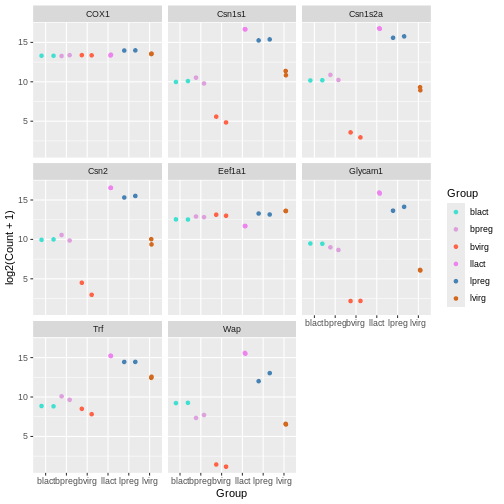
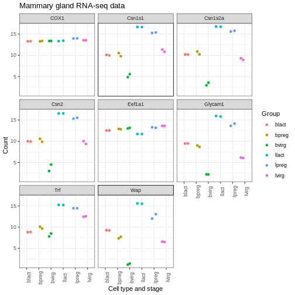
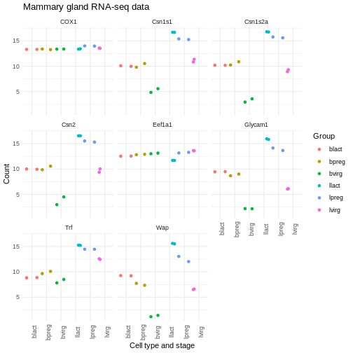

:::::::::::::::::::::::::::::::::::::: questions 

- How can you add a title and change the axis labels in a ggplot?

::::::::::::::::::::::::::::::::::::::::::::::::

::::::::::::::::::::::::::::::::::::: objectives

- Understand how to specify colours of a plot, either manually or by using a predefined palette
- Explore modifying the `theme()` function in ggplot to adjust plot aesthetics

::::::::::::::::::::::::::::::::::::::::::::::::


:::::::::::::::::::::::::::::::::::::::::::::::::::::::::::::::::::: instructor

This chapter can be skipped if running low on time.

::::::::::::::::::::::::::::::::::::::::::::::::::::::::::::::::::::::::::::::::


## Specifying colours

You might want to control plotting colours. To see what colour names are
available you can type `colours()`. There is also an [R colours
cheatsheet](https://www.nceas.ucsb.edu/~frazier/RSpatialGuides/colorPaletteCheatsheet.pdf)
that shows what the colours look like.


``` r
mycolours <- c("turquoise", "plum", "tomato", "violet", "steelblue", "chocolate")
```

Then we then add these colours to the plot using a `+` and
`scale_colour_manual(values = mycolours)`.


``` r
ggplot(data = mygenes_counts, 
       mapping = aes(x = Group, y = log2(Count + 1), colour = Group)) +
  geom_jitter() +
  facet_wrap(~ gene_symbol) +
  scale_colour_manual(values = mycolours)
```




There are built-in colour palettes that can be handy to use, where the
sets of colours are predefined. `scale_colour_brewer()` is a popular one
(there is also `scale_fill_brewer()`). You can take a look at the help
for `scale_colour_brewer()` to see what palettes are available. The [R
colours
cheatsheet](https://www.nceas.ucsb.edu/~frazier/RSpatialGuides/colorPaletteCheatsheet.pdf)
also shows what the colours of the palettes look like. There's one
called "Dark2", let's have a look at that.


``` r
ggplot(data = mygenes_counts, 
       mapping = aes(x = Group, y = log2(Count + 1), colour = Group)) +
  geom_jitter() +
  facet_wrap(~ gene_symbol) +
  scale_colour_brewer(palette = "Dark2")
```


-----

## Axis labels and Title

We can change the axis labels and add a title with `labs()`. To change
the x axis label we use `labs(x = "New name")`. To change the y axis
label we use `labs(y = "New name")` or we can change them all at the
same time.


``` r
ggplot(data = mygenes_counts, 
       mapping = aes(x = Group, y = log2(Count + 1), colour = Group)) +
  geom_jitter() +
  facet_wrap(~ gene_symbol) +
  labs(x = "Cell type and stage", y = "Count", title = "Mammary gland RNA-seq data")
```


-----

## Themes

We can adjust the text on the x axis (the group labels) by turning them
90 degrees so we can read the labels better. To do this we modify the
ggplot theme. Themes are the non-data parts of the plot.


``` r
ggplot(data = mygenes_counts, 
       mapping = aes(x = Group, y = log2(Count + 1), colour = Group)) +
  geom_jitter() +
  facet_wrap(~ gene_symbol) +
  labs(x = "Cell type and stage", y = "Count", title = "Mammary gland RNA-seq data") +
  theme(axis.text.x = element_text(angle = 90))
```


We can remove the grey background and grid lines.

There are also a lot of built-in themes. Let's have a look at a couple
of the more widely used themes. The default ggplot theme is
`theme_grey().`


``` r
ggplot(data = mygenes_counts, 
       mapping = aes(x = Group, y = log2(Count + 1), colour = Group)) +
  geom_jitter() +
  facet_wrap(~ gene_symbol) +
  labs(x = "Cell type and stage", y = "Count", title = "Mammary gland RNA-seq data") +
  theme_bw() +
  theme(axis.text.x = element_text(angle = 90))
```




``` r
ggplot(data = mygenes_counts, 
       mapping = aes(x = Group, y = log2(Count + 1), colour = Group)) +
  geom_jitter() +
  facet_wrap(~ gene_symbol) +
  labs(x = "Cell type and stage", y = "Count", title = "Mammary gland RNA-seq data") +
  theme_minimal() +
  theme(axis.text.x = element_text(angle = 90))
```



There are many themes available, you can see some in the [R graph
gallery](https://www.r-graph-gallery.com/192-ggplot-themes/).

We can also modify parts of the theme individually. We can remove the
grey background and grid lines with the code below.


``` r
ggplot(data = mygenes_counts, 
       mapping = aes(x = Group, y = log2(Count + 1), colour = Group)) +
  geom_jitter() +
  facet_wrap(~ gene_symbol) +
  labs(x = "Cell type and stage", y = "Count", title = "Mammary gland RNA-seq data") +
  theme(axis.text.x = element_text(angle = 90)) +
  theme(panel.background = element_blank(),
        panel.grid.major = element_blank(),
        panel.grid.minor = element_blank())
```


-----

## Order of categories

The groups have been plotted in alphabetical order on the x axis and in
the legend (that is the default order), however, we may want to change
the order. We may prefer to plot the groups in order of stage, for
example, basal virgin, basal pregnant, basal lactate, luminal virgin,
luminal pregnant, luminal lactate.

First let's make an object with the group order that we want.


``` r
group_order <- c("bvirg", "bpreg", "blact", "lvirg", "lpreg", "llact")
```

Next we need to make a column with the groups into an R data type called
a **factor**. Factors in R are a special data type used to specify
categories, you can read more about them in the [R for Data Science
book](https://r4ds.had.co.nz/vectors.html#augmented-vectors). The names
of the categories are called the factor **levels**.

We'll add another column called "Group_f" where we'll make the Group
column into a factor and specify what order we want the levels of the
factor.


``` r
mygenes_counts <- mutate(mygenes_counts, Group_f = factor(Group, levels = group_order))
```

Take a look at the data. As the table is quite wide we can use
`select()` to select just the columns we want to view.


``` r
select(mygenes_counts, gene_id, Group, Group_f)
```

``` output
# A tibble: 96 × 3
   gene_id            Group Group_f
   <chr>              <chr> <fct>  
 1 ENSMUSG00000000381 lvirg lvirg  
 2 ENSMUSG00000000381 lvirg lvirg  
 3 ENSMUSG00000000381 lpreg lpreg  
 4 ENSMUSG00000000381 lpreg lpreg  
 5 ENSMUSG00000000381 llact llact  
 6 ENSMUSG00000000381 llact llact  
 7 ENSMUSG00000000381 bvirg bvirg  
 8 ENSMUSG00000000381 bvirg bvirg  
 9 ENSMUSG00000000381 bpreg bpreg  
10 ENSMUSG00000000381 bpreg bpreg  
# ℹ 86 more rows
```

Notice that the Group column has `<chr>` under the heading, that
indicates is a character data type, while the Group_f column has `<fct>`
under the heading, indicating it is a factor data type. The `str()`
command that we saw previously is useful to check the data types in
objects.


``` r
str(mygenes_counts)
```

``` output
tibble [96 × 9] (S3: tbl_df/tbl/data.frame)
 $ gene_id            : chr [1:96] "ENSMUSG00000000381" "ENSMUSG00000000381" "ENSMUSG00000000381" "ENSMUSG00000000381" ...
 $ gene_symbol        : chr [1:96] "Wap" "Wap" "Wap" "Wap" ...
 $ Sample             : chr [1:96] "GSM1480291" "GSM1480292" "GSM1480293" "GSM1480294" ...
 $ Count              : num [1:96] 90.2 95.6 4140.3 8414.4 49204.9 ...
 $ characteristics    : chr [1:96] "mammary gland, luminal cells, virgin" "mammary gland, luminal cells, virgin" "mammary gland, luminal cells, 18.5 day pregnancy" "mammary gland, luminal cells, 18.5 day pregnancy" ...
 $ immunophenotype    : chr [1:96] "luminal cell population" "luminal cell population" "luminal cell population" "luminal cell population" ...
 $ developmental stage: chr [1:96] "virgin" "virgin" "18.5 day pregnancy" "18.5 day pregnancy" ...
 $ Group              : chr [1:96] "lvirg" "lvirg" "lpreg" "lpreg" ...
 $ Group_f            : Factor w/ 6 levels "bvirg","bpreg",..: 4 4 5 5 6 6 1 1 2 2 ...
```

`str()` shows us Group_f column is a Factor with 6 levels (categories).

We can check the factor levels of a column as below.


``` r
levels(mygenes_counts$Group_f)
```

``` output
[1] "bvirg" "bpreg" "blact" "lvirg" "lpreg" "llact"
```

The levels are in the order that we want, so we can now change our plot
to use the "Group_f" column instead of Group column (change `x =` and
`colour =`).


``` r
ggplot(data = mygenes_counts, 
       mapping = aes(x = Group_f, y = log2(Count + 1), colour = Group_f)) +
  geom_jitter() +
  facet_wrap(~ gene_symbol) +
  labs(x = "Cell type and stage", y = "Count", title = "Mammary gland RNA-seq data") +
  theme(axis.text.x = element_text(angle = 90)) +
  theme(panel.background = element_blank(),
        panel.grid.major = element_blank(),
        panel.grid.minor = element_blank())
```


We could do similar if we wanted to have the genes in the facets in a
different order. For example, we could add another column called
"gene_symbol_f" where we make the gene_symbol column into a factor,
specifying the order of the levels.


::::::::::::::::::::::::::::::::::::: challenge

#### Exercise

Make a colourblind-friendly plot using the colourblind-friendly palettes [here](https://www.cookbook-r.com/Graphs/Colors_(ggplot2)/#a-colorblind-friendly-palette).

:::::::::::::::::::::::::::::::::::::


::::::::::::::::::::::::::::::::::::: keypoints 

- In `ggplot2`, you can specify colours manually using the `scale_colour_manual()` function or use a predefined palette using the `scale_colour_brewer()` function
- The `labs()` function allows you to set a plot title and change axis labels
- Complete themes such as `theme_bw()` and `theme_classic()` can be used to change the appearance of a plot
- Using the `theme()` function allows you to tweak components of a theme

::::::::::::::::::::::::::::::::::::::::::::::::

