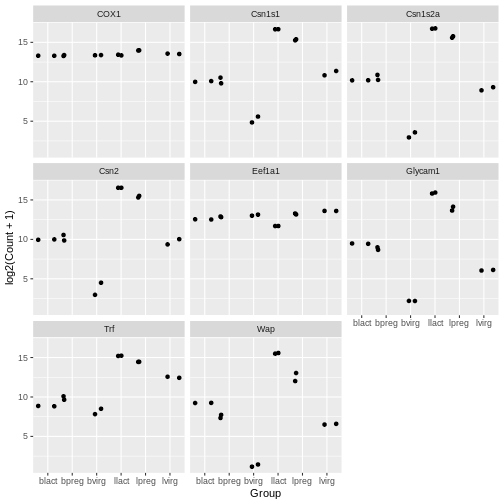

:::::::::::::::::::::::::::::::::::::: questions 

- What are the three components needed for creating a plot in ggplot2?

::::::::::::::::::::::::::::::::::::::::::::::::

::::::::::::::::::::::::::::::::::::: objectives

- Explain how to plot a basic plot in ggplot2
- Learn how to modify plots using colours and facets

::::::::::::::::::::::::::::::::::::::::::::::::

## Plotting with **`ggplot2`**


**`ggplot2`** is a plotting package that makes it simple to create
complex plots. One really great advantage compared to classic R packages
is that we only need to make minimal changes if the underlying data
change or if we decide to change our plot type, for example, from a box
plot to a violin plot. This helps in creating publication quality plots
with minimal amounts of adjustments and tweaking.

**`ggplot2`** likes data in the 'long' format, i.e., a column for every
variable, and a row for every observation, similar to what we created
with `pivot_longer()` above. Well-structured data will save you lots of
time when making figures with **`ggplot2`**.


::: callout
#### Understanding ggplot2 Architecture

ggplot2 plots are built step by step by adding layers with `+`. This approach provides great flexibility, allowing you to customize your plots extensively.
:::


To build a ggplot, we use the following basic template that can be used
for different types of plots. Three things are required for a ggplot:


1.  The data
2.  The columns in the data we want to map to visual properties (called
    aesthetics or `aes`) e.g. the columns for x values, y values and
    colours
3.  The type of plot (the `geom_`)

There are different geoms we can use to create different types of plot
e.g. `geom_line()` `geom_point()`, `geom_boxplot()`. To see the geoms
available take a look at the ggplot2 help or the handy [ggplot2
cheatsheet](https://rstudio.github.io/cheatsheets/data-visualization.pdf).
Or if you type "geom" in RStudio, RStudio will show you the different
types of geoms you can use.


-----

## Creating a boxplot

Let's plot boxplots to visualise the distribution of the counts for each
sample. This helps us to compare the samples and check if any look
unusual.

*Note: In commands that span multiple lines in R, "+" must go at the end of the line—it can't go
at the beginning.*

::::::::::::::::::::::::::::::::::::: challenge

#### Your turn 4.1

Run the following command line. Identify the key
functions `aes` and type of plot:


``` r
ggplot(data = allinfo, mapping = aes(x = Sample, y = Count)) + 
  geom_boxplot()
```


:::::::::::::::::::::::::::::::::::::::::::::::::

This plot looks a bit weird. It's because we have some genes with
extremely high counts. To make it easier to visualise the distributions
we usually plot the logarithm of RNA-seq counts. We'll plot the Sample
on the X axis and log2 Counts on the y axis. We can log the Counts
within the `aes()`. The sample labels are also overlapping each other,
we will show how to fix this later.


::::::::::::::::::::::::::::::::::::: challenge

#### Your turn 4.2

Generate a boxplot of log2 gene counts


``` r
ggplot(data = allinfo, mapping = aes(x = Sample, y = log2(Count))) + 
  geom_boxplot()
```

``` warning
Warning: Removed 84054 rows containing non-finite outside the scale range
(`stat_boxplot()`).
```


:::::::::::::::::::::::::::::::::::::::::::::::::

We get a warning here about rows containing non-finite values being
removed. This is because some of the genes have a count of zero in the
samples and a log of zero is undefined. We can add +1 to every count to
avoid the zeros being dropped ('psuedo-count').


::::::::::::::::::::::::::::::::::::: challenge

#### Your turn 4.3

Generate a boxplot of log2 gene counts + 1

``` r
ggplot(data = allinfo, mapping = aes(x = Sample, y = log2(Count + 1))) + 
  geom_boxplot()
```


:::::::::::::::::::::::::::::::::::::::::::::::::

The box plots show that the distributions of the samples are not
identical but they are not very different.

-----

## Violin plot

Boxplots are useful summaries, but hide the shape of
the distribution. For example, if the distribution is bimodal, we would
not see it in a boxplot. An alternative to the boxplot is the **violin
plot**, where the shape (of the density of points) is drawn.

Let's choose a different geom to do another type of plot. 


::::::::::::::::::::::::::::::::::::: challenge

#### Your turn 4.4

Using the same data (same x and y values), try editing the code 
above to make a violin plot using the `geom_violin()` function.

:::::::::::::::: solution


``` r
# Plotting a violin plot
ggplot(data = allinfo, mapping = aes(x = Sample, y = log2(Count + 1))) + 
  geom_violin()
```


::::::::::::::::::::::::::

:::::::::::::::::::::::::::::::::::::::::::::::::

-----

## Colouring by categories

Let's add a different colour for each sample.

::::::::::::::::::::::::::::::::::::: challenge

#### Your turn 4.5

View the help file for `geom_boxplot` and scroll down
to **Aesthetics** heading. It specifies that there is an option for
colour.

:::::::::::::::::::::::::::::::::::::::::::::::::

::::::::::::::::::::::::::::::::::::: challenge

#### Your turn 4.6

Map each sample to a colour using the `colour =` argument. 
As we are mapping colour to a column in our data we need to put this inside `aes()`.


``` r
ggplot(data = allinfo, mapping = aes(x = Sample, y = log2(Count + 1), colour = Sample)) + 
  geom_boxplot()
```


:::::::::::::::::::::::::::::::::::::::::::::::::

Colouring the edges wasn't quite what we had in mind. Look at the help
for `geom_boxplot` to see what other aesthetic we could use. Let's try
`fill =` instead.

::::::::::::::::::::::::::::::::::::: challenge

#### Your turn 4.7

Map each sample to a colour using the `fill =` argument. 


``` r
ggplot(data = allinfo, mapping = aes(x = Sample, y = log2(Count + 1), fill = Sample)) + 
  geom_boxplot()
```


That looks better. `fill =` is used to fill in areas in ggplot2
plots, whereas `colour =` is used to colour lines and points.

:::::::::::::::::::::::::::::::::::::::::::::::::

A really nice feature about ggplot is that we can easily colour by
another variable by simply changing the column we give to `fill =`.

-----

## Creating subplots for each gene using faceting

With ggplot we can easily make subplots using *faceting*. For example we
can make
[stripcharts](http://www.sthda.com/english/wiki/ggplot2-stripchart-jitter-quick-start-guide-r-software-and-data-visualization).
These are a type of scatterplot and are useful when there are a small
number of samples (when there are not too many points to visualise).
Here we will make stripcharts plotting expression by the groups (basal
virgin, basal pregnant, basal lactating, luminal virgin, luminal
pregnant, luminal lactating) for each gene.

### Shorter category names

As we saw in question 5.5, our column names are quite long, and this might make them
difficult to visualise on a plot. We can use the function `mutate()` to add another column to our `allinfo` object with shorter group names. 


::::::::::::::::::::::::::::::::::::: challenge

#### Your turn 4.8

Make a new column in `allinfo` with shortened category names using the below code. How has the object `allinfo` changed?


``` r
allinfo <- mutate(allinfo, Group = case_when(
        str_detect(characteristics, "basal.*virgin") ~  "bvirg",
        str_detect(characteristics, "basal.*preg")  ~  "bpreg",
        str_detect(characteristics, "basal.*lact")  ~  "blact",
        str_detect(characteristics, "luminal.*virgin")  ~  "lvirg",
        str_detect(characteristics, "luminal.*preg")  ~  "lpreg",
        str_detect(characteristics, "luminal.*lact")  ~  "llact"
       ))
```

Note: While not covered in this workshop, the above code uses [regular expressions](https://en.wikipedia.org/wiki/Regular_expression) to match patterns of characters in a string.

:::::::::::::::: solution


``` r
head(allinfo)
```

``` output
# A tibble: 6 × 8
  gene_id            gene_symbol Sample    Count characteristics immunophenotype
  <chr>              <chr>       <chr>     <dbl> <chr>           <chr>          
1 ENSMUSG00000000001 Gnai3       GSM14802… 243.  mammary gland,… luminal cell p…
2 ENSMUSG00000000001 Gnai3       GSM14802… 256.  mammary gland,… luminal cell p…
3 ENSMUSG00000000001 Gnai3       GSM14802… 240.  mammary gland,… luminal cell p…
4 ENSMUSG00000000001 Gnai3       GSM14802… 217.  mammary gland,… luminal cell p…
5 ENSMUSG00000000001 Gnai3       GSM14802…  84.7 mammary gland,… luminal cell p…
6 ENSMUSG00000000001 Gnai3       GSM14802…  84.6 mammary gland,… luminal cell p…
# ℹ 2 more variables: `developmental stage` <chr>, Group <chr>
```

We observe a new column called `Group` at the end which has shortened category names, bvirg, lpreg, etc. 

::::::::::::::::::::::::::

:::::::::::::::::::::::::::::::::::::::::::::::::

### Filter for genes of interest

::::::::::::::::::::::::::::::::::::: challenge

#### Your turn 4.9

How many genes are there in our data?

:::::::::::::::: solution


``` r
dim(counts)
```

``` output
[1] 23735    14
```

There are 23735 rows in our original counts data, so we have data on 23735 different genes. Note: we didn't run `dim()` on our `allinfo` object because this has multiple rows per gene. 

::::::::::::::::::::::::::

:::::::::::::::::::::::::::::::::::::::::::::::::

Like our data set, most RNA-seq data sets have information on thousands of genes, but most of them are usually not very interesting, so we may want to filter them. 

Here, we choose 8 genes with the highest counts summed across all samples. They
are listed here. 


::::::::::::::::::::::::::::::::::::: challenge

#### Your turn 4.10

Create an object with a list of the 8 most highly expressed genes


``` r
mygenes <- c("Csn1s2a", "Csn1s1", "Csn2", "Glycam1", "COX1", "Trf", "Wap", "Eef1a1")
```

We filter our data for just these genes of interest. We use `%in%` to
check if a value is in a set of values.

Filter the counts data to only include genes in the `mygenes` object


``` r
mygenes_counts <- filter(allinfo, gene_symbol %in% mygenes)
```

:::::::::::::::::::::::::::::::::::::::::::::::::


::::::::::::::::::::::::::::::::::::: challenge

#### Your turn 4.11

Can you figure out how many rows `mygenes_counts` will have without inspecting the object? Print the dimensions of the object to check if you're right. 

:::::::::::::::: solution

There is one row per sample per gene in `mygenes_counts` (as is the case in `allinfo`). As there are 8 genes left after filtering, and 12 samples in our data, we expect there to be 96 rows in `mygenes_counts`.


``` r
# We expect there to be 8 x 12 rows in mygenes_counts
8 * 12
```

``` output
[1] 96
```

``` r
# That is correct!
dim(mygenes_counts)
```

``` output
[1] 96  8
```

::::::::::::::::::::::::::

:::::::::::::::::::::::::::::::::::::::::::::::::

::: spoiler

#### Selecting the genes

To identify these 8 genes, we used
[pipes](https://r4ds.had.co.nz/pipes.html) (`%>%`) to string a series of
function calls together (which is beyond the scope of this tutorial, but
totally worth learning about independently!).

```         
mygenes <- allinfo %>%  
  group_by(gene_symbol) %>%  
  summarise(Total_count = sum(Count)) %>%  
  arrange(desc(Total_count)) %>%  
  head(n = 8) %>%  
  pull(gene_symbol) 
```
:::


### Faceting

::::::::::::::::::::::::::::::::::::: challenge

#### Your turn 4.12

Make boxplots faceted by gene, grouped and coloured by groups


``` r
ggplot(data = mygenes_counts, 
       mapping = aes(x = Group, y = log2(Count + 1), fill = Group)) +
  geom_boxplot() +
  facet_wrap(~ gene_symbol)
```


Here we *facet* on the `gene_symbol` column using
`facet_wrap()`. We add the tilde symbol `~` in front of the column we
want to facet on.

:::::::::::::::::::::::::::::::::::::::::::::::::

-----

## Scatterplots

In the example over, boxplots are not suitable because we only have two
values per group. Let's plot the individual points instead using the
`geom_point()` to make a scatter plot.


::::::::::::::::::::::::::::::::::::: challenge

#### Your turn 4.13

Make scatter plots faceted by gene and grouped by groups


``` r
ggplot(data = mygenes_counts, mapping = aes(x = Group, y = log2(Count + 1))) +
  geom_point() +
  facet_wrap(~ gene_symbol)
```


:::::::::::::::::::::::::::::::::::::::::::::::::

### Jitter plot

In the previous plots, the points are overlapping which makes it hard to see them. We can make a jitter plot using `geom_jitter()` which adds a small amount of random variation to the location of each point so they do not overlap. If is also quite common
to combine jitter plots with other types of plot, for example, [jitter
with boxplot](https://simplystatistics.org/2019/02/21/dynamite-plots-must-die/).


::::::::::::::::::::::::::::::::::::: challenge

#### Your turn 4.14

Make jitter plots faceted by gene and grouped by groups


``` r
ggplot(data = mygenes_counts, mapping = aes(x = Group, y = log2(Count + 1))) +
  geom_jitter() +
  facet_wrap(~ gene_symbol)
```



:::::::::::::::::::::::::::::::::::::::::::::::::


::::::::::::::::::::::::::::::::::::: challenge

#### Your turn 4.15

Modify the code above to colour the jitter plots by group

:::::::::::::::: solution


``` r
ggplot(data = mygenes_counts, 
       mapping = aes(x = Group, y = log2(Count + 1), colour = Group)) +
  geom_jitter() +
  facet_wrap(~ gene_symbol)
```


Note that for jitter plots you will want to use the `colour = ` slot rather than the `fill = ` slot. 

::::::::::::::::::::::::::

:::::::::::::::::::::::::::::::::::::::::::::::::

-----------

::::::::::::::::::::::::::::::::::::: keypoints 

- A ggplot has 3 components: data (dataset), mapping (columns to plot) and geom (type of plot). Different types of plots include `geom_point()`, `geom_jitter()`, `geom_line()`, `geom_boxplot()`, `geom_violin()`.
- `facet_wrap()` can be used to make subplots of the data
- The aesthetics of a ggplot can be modified, such as colouring by different columns in the dataset

::::::::::::::::::::::::::::::::::::::::::::::::

