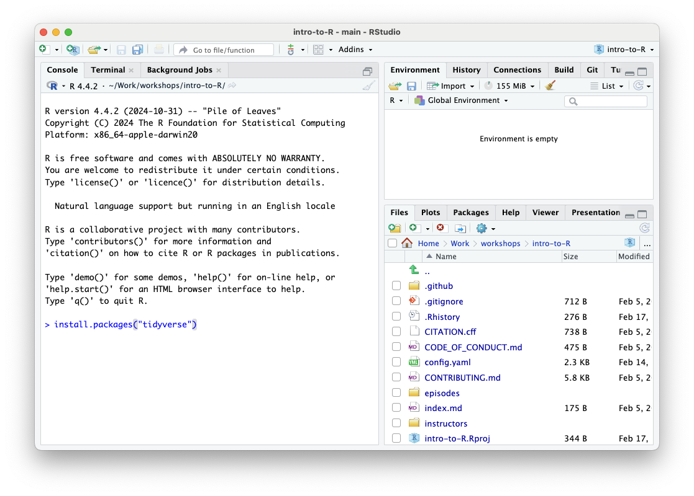

## Data Sets

Download the [data zip file](data/data.zip). This is the data that you will use in the workshop.


## Software Setup

Software you will need on your computer prior to starting this workshop:

1.  R
2.  RStudio
3.  The tidyverse R package

All three of these pieces of software are free and open-source.


### 1. Installing R

Go to the CRAN (The Comprehensive R Archive Network) website: <https://cran.r-project.org/>

At the top of the page, click on link that corresponds to your operating system.


::: tab

### Windows

After clicking on the **Download R for Windows** link, click **base** and download the latest R version for Windows.

Run the executable file and follow the instructions.


### MacOS

After clicking on the **Download R for macOS** link, choose between the Apple 
Silicon or Intel x86 versions of R, and download the .pkg file.

If you don't know what chipset your computer uses, you can click on the Apple 
icon on the top left of your menu bar and click on "About This Mac". 
Look at the Chip field or Processor field. If it contains something like 
"Apple M1" or "M2", etc. then download the file for Apple Silicon. If it 
contains an Intel chip, then download the file for Intel Macs.

Run the .pkg file and follow the instructions.


### Linux

Click on the **Download R for Linux** link or the link for the distro you're
using. Follow the instructions to install R.

:::


### 2. Installing RStudio

Go to the [Posit website page for RStudio](https://posit.co/download/rstudio-desktop/) 
and click on the button to download RStudio for your operating system.

Install the software on your computer.


### 3. Installing the tidyverse R package

Run RStudio. You should see an interface with several panels. The console panel
should be on the left hand side.



Type:

```r
install.packages("tidyverse")
```

and press <kbd>enter</kbd>.

R will begin downloading and installing some packages which will take a few 
minutes. You will see the progress of these downloads and installations in the
console.

When done, verify the package installed by loading it. Type:

```r
library(tidyverse)
```
and press <kbd>enter</kbd>.

You should see output similar to this if tidyverse was installed correctly,
although the version numbers may differ:


